# 📸 QR Party 스크린샷 상세

> 전체 화면 캡처 모음. 초기 화면은 [README.md](README.md)에서 확인할 수 있습니다.

---

## 📱 참여자 모바일 화면

> iPhone 14 Pro (390×844) 기준 모바일 세로 화면

### 랜딩 & 온보딩

|  | 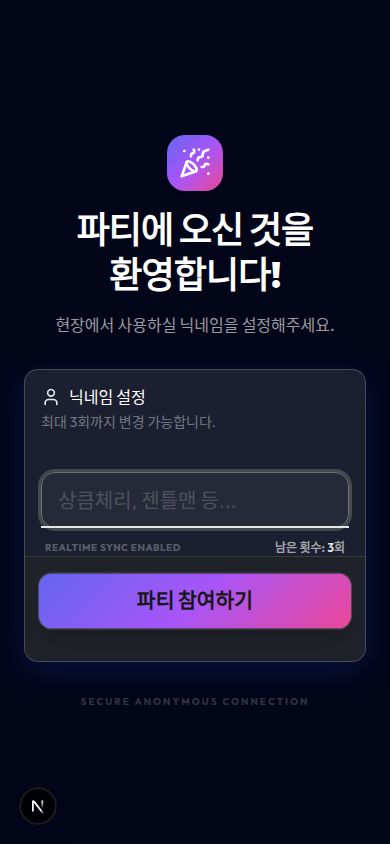 | 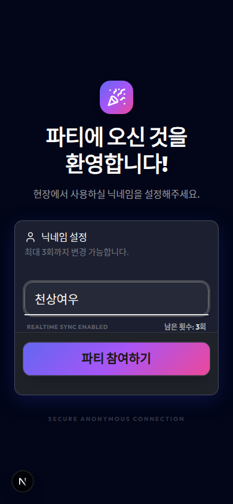 |
|:---:|:---:|:---:|
| **랜딩 페이지** | **닉네임 설정 화면** | **닉네임 입력 완료** |

### 대시보드

| 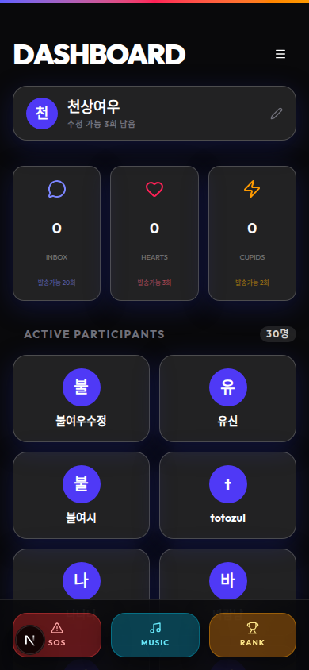 | 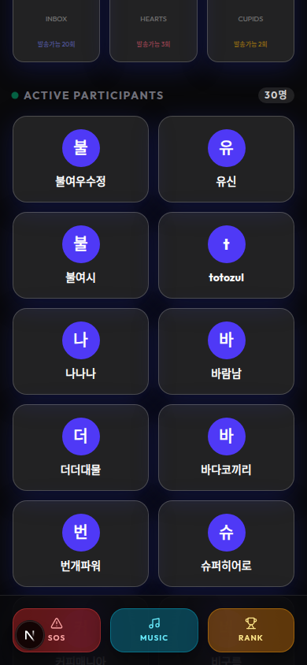 | 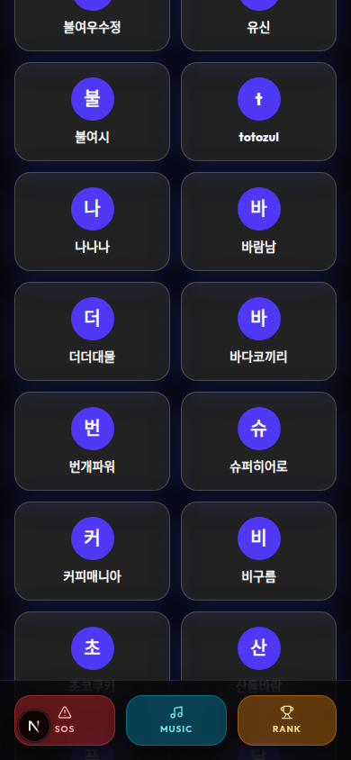 |
|:---:|:---:|:---:|
| **대시보드 메인** | **스탯 카드 (Inbox/Hearts/Cupids)** | **참여자 목록** |

### 상호작용 (바람남에게)

| 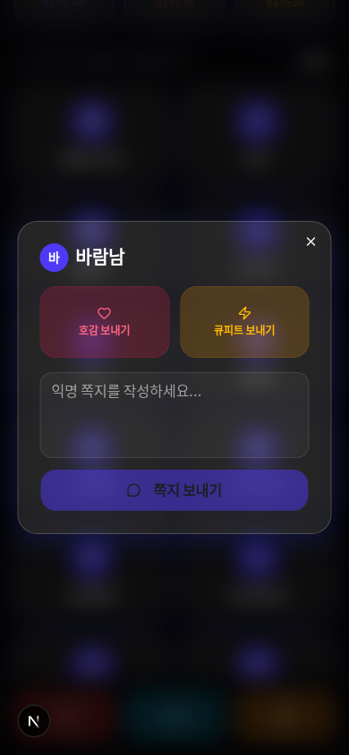 | 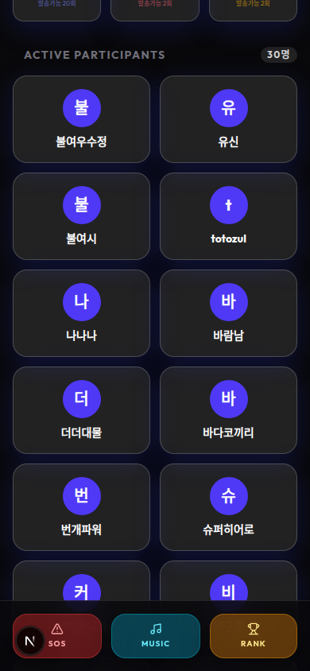 |  |
|:---:|:---:|:---:|
| **상호작용 다이얼로그** | **호감(Heart) 보내기** | **큐피트(Cupid) 보내기** |

| 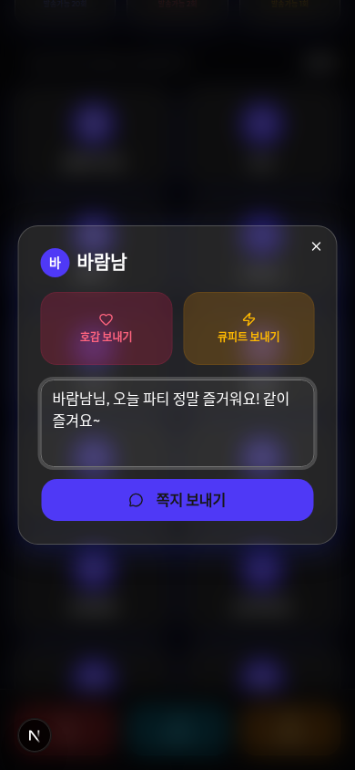 | 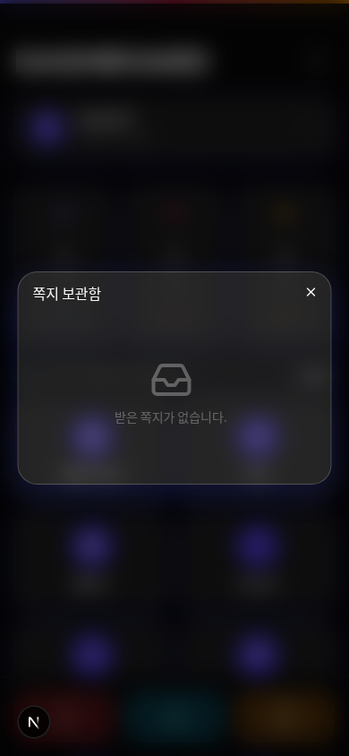 | 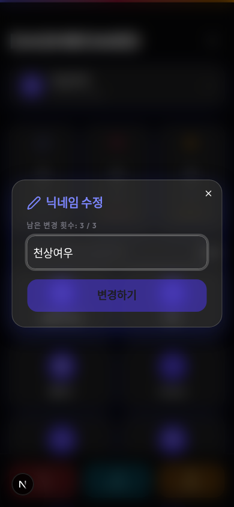 |
|:---:|:---:|:---:|
| **쪽지 보내기** | **쪽지 보관함** | **닉네임 수정 다이얼로그** |

### 닉네임 변경 & SOS & 노래신청

| 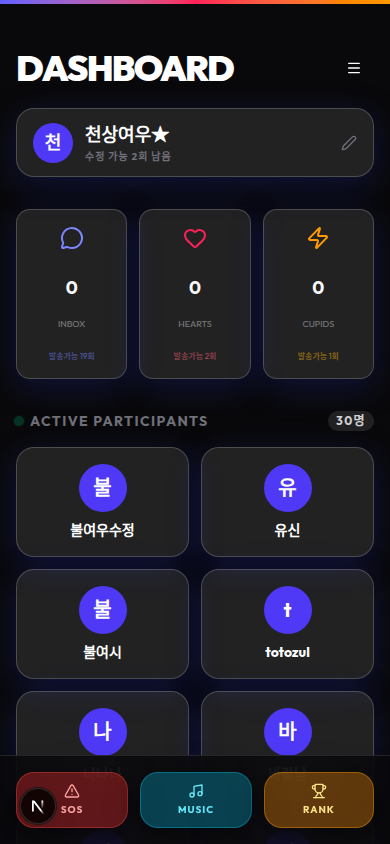 | 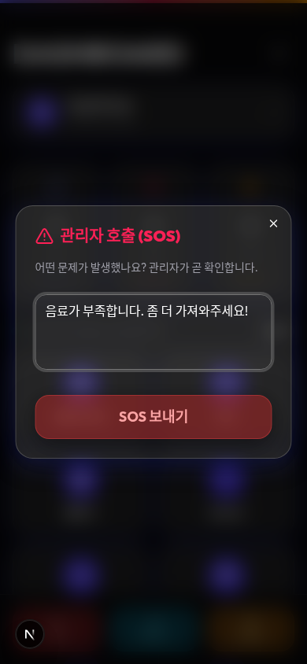 | 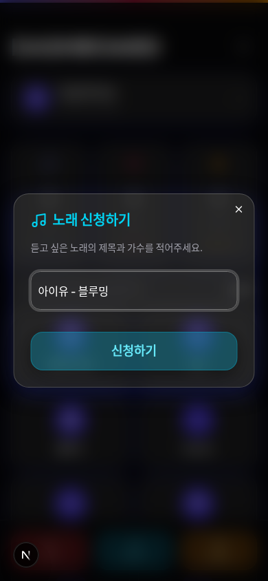 |
|:---:|:---:|:---:|
| **닉네임 변경 완료** | **SOS 관리자 호출** | **노래 신청** |

### 랭킹 & 사이드바 이력

| 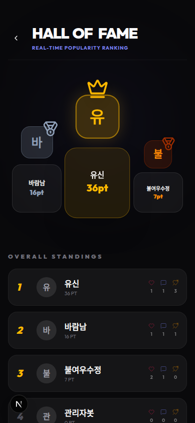 | 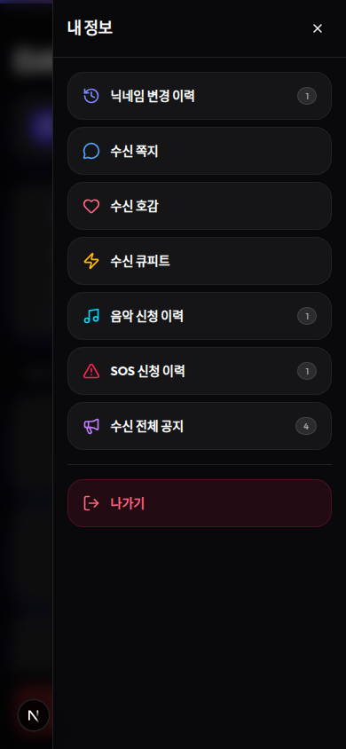 | 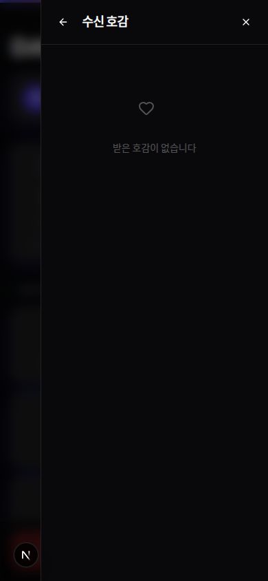 |
|:---:|:---:|:---:|
| **실시간 랭킹 (Hall of Fame)** | **사이드바 메뉴 (이력)** | **수신 호감 이력** |

---

## 🖥 관리자 PC 화면

> PC 브라우저 (1440×900) 기준 관리자 콘솔 화면

### 로그인 & 콘솔 메인

|  |  |
|:---:|:---:|
| **관리자 로그인** | **관리자 콘솔 메인 (현황판 탭)** |

### 현황판 - SOS/노래신청 처리

| 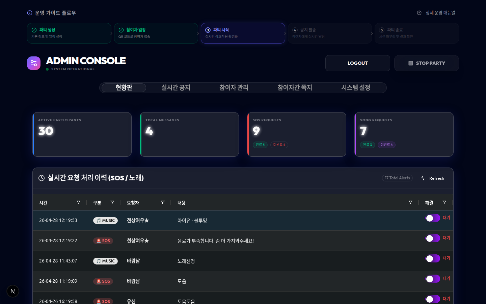 | 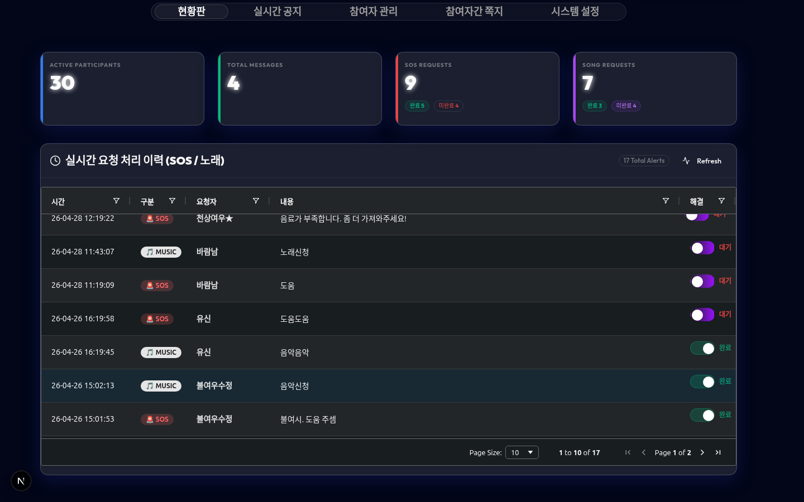 |
|:---:|:---:|
| **현황판 (통계 카드 + 요청 그리드)** | **SOS/노래신청 토글 스위치로 처리** |

### 실시간 공지

|  | 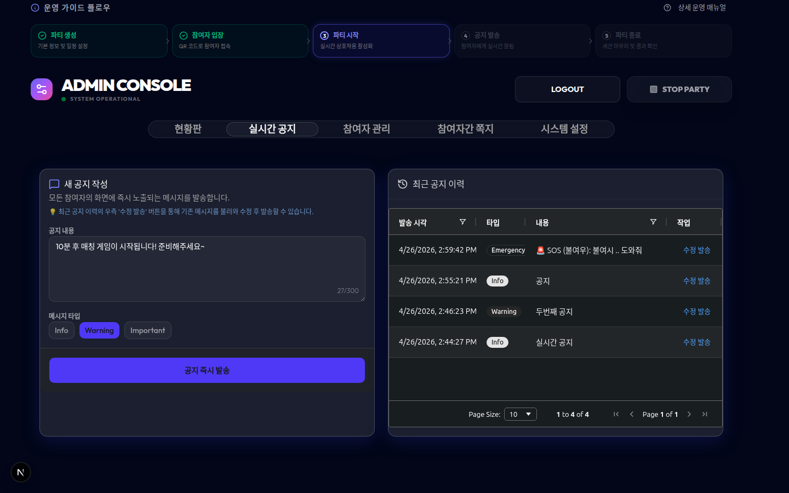 |
|:---:|:---:|
| **실시간 공지 탭 (이력)** | **공지 작성 및 발송** |

### 참여자 관리

| 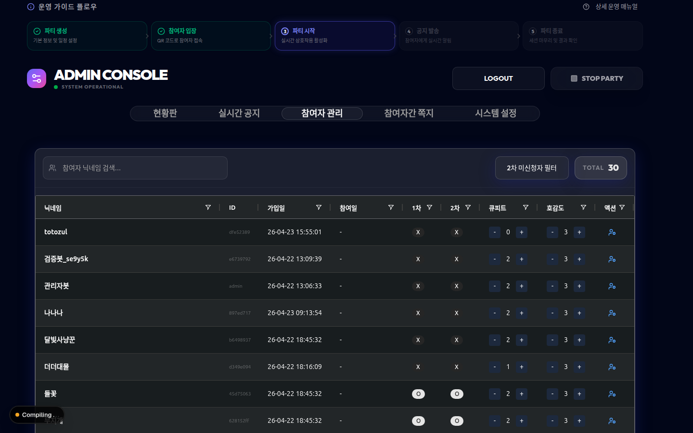 | 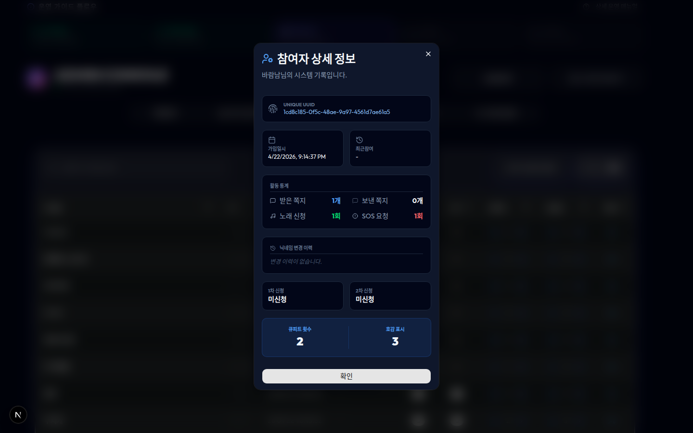 |
|:---:|:---:|
| **참여자 관리 탭 (AG Grid)** | **참여자 상세 정보 팝업** |

### 쪽지 모니터링 & 시스템 설정

| 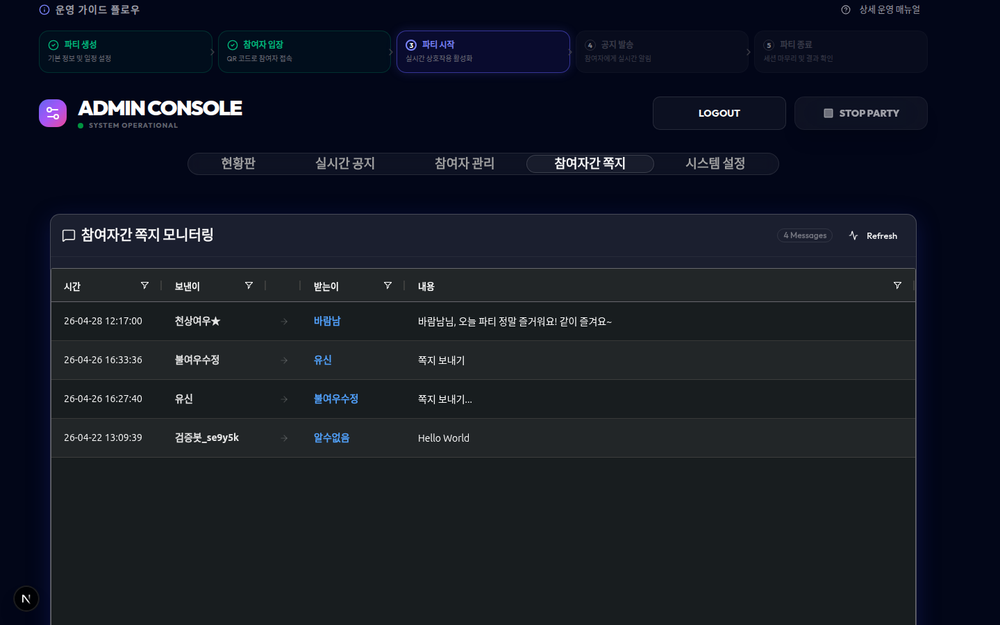 | 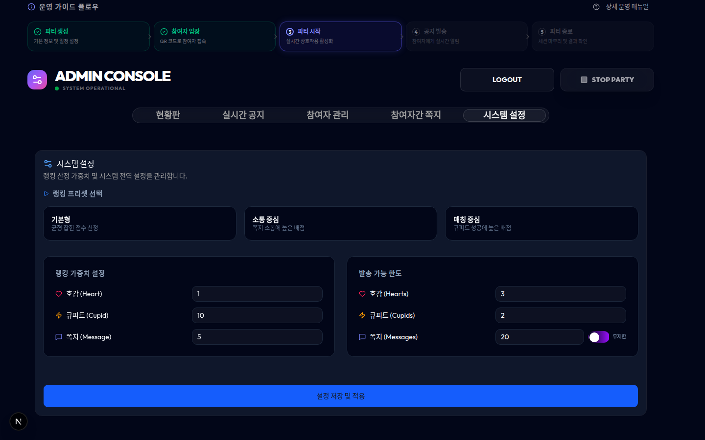 |
|:---:|:---:|
| **참여자간 쪽지 모니터링** | **시스템 설정 탭** |
